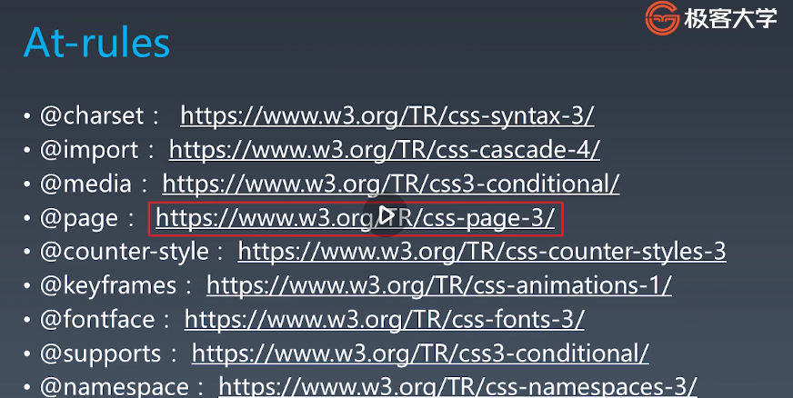
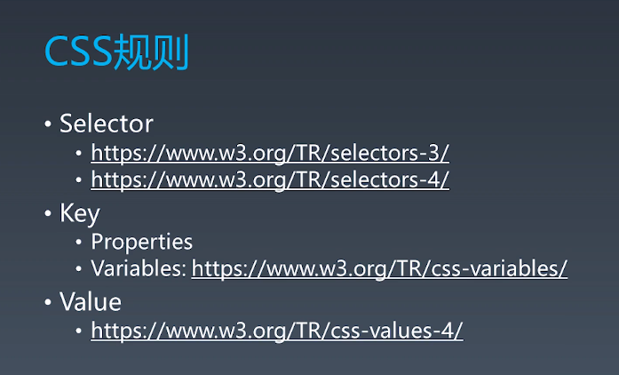

### css 总体规则

- @charset
- @import
- rules
  - @media
  - @page
  - rule

### css结构

- at-rules
  - @charset
  - @import
  - @media
  - @page
  - @counter-style
  - @keyframes
  - @fontface
  - @supports
  - @namespace
  - 
- rule
  - Selector
    - selector_group
    - selector
      - \>
      - <sp>
      - +
      - ~
    - simple_selector
      - type
      - *
      - .
      - #
      - []
      - :
      - ::
      - :not()
  - Declaration
    - Key
      - variables
      - properties
    - Value
      - calc
      - number
      - length
      - ......

#### css 规则

- 选择器
- 声明
  - Key
  - Value
  
- 

#### 选择器

- *
- div svg|a
- .cls
- #id
- [attr=value]
- :hover
- ::before

#### 选择器语法

- 符合选择器
  - <简单选择器><简单选择器><简单选择器>
  - *或div必须写在前面
- 复杂选择器
  - <符合选择器><sp><复合选择器>
  - <符合选择器>">"<复合选择器>
  - <符合选择器>"~"<复合选择器>
  - <符合选择器>"+"<复合选择器>
  - <符合选择器>"||"<复合选择器>

#### 伪类 

- 链接行为
  - :any-link
  - :link :visited
  - :hover
  - :active
  - :focus
  - :target
- 树结构
  - :empty
  - :nth-child()
  - :nth-last-child()
  - :first-child :last-child : only-child
- 逻辑型
  - :not伪类
  - :where :has
- 伪元素
  - ::before
  - ::after
  - ::first-line
  - ::first-letter

