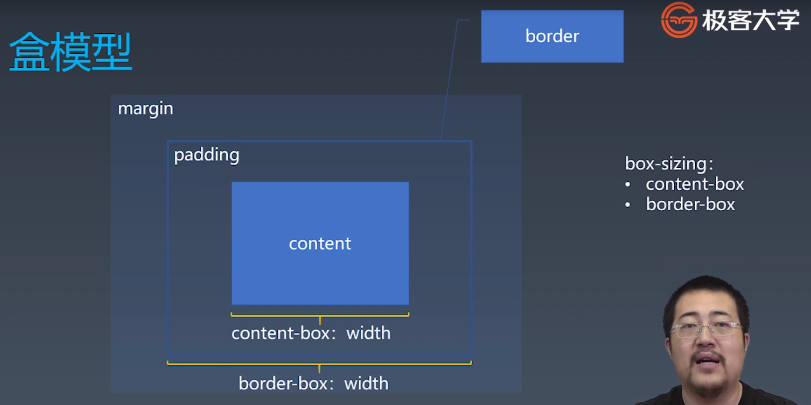

### css排版

| 源代码 | 语义    | 表现 |
| ------ | ------- | ---- |
| 标签   | 元素    | 盒   |
| Tag    | Element | Box  |

HTML代码中可以书写开始 **标签** ，结束 **标签**  ，和子封闭  **标签** 。

一对起止  **标签** ，表示一个  **元素**  。

DOM树中存储的是  **元素** 和其他类型的节点Node。

CSS选择器选中的是   **元素**  。

CSS选择器选中的  **元素**  ， 在排版时可能产生多个 **盒**   。

排版和渲染的基本单位是  **盒** 。

### 盒模型

### 正常流

- 收集盒和文字进行
- 计算盒和文字在行中的排布
- 计算行的排布
  - inline -level-box行内级别的盒
  - block-level-box 块级盒

### 正常流的行级排布

### 正常流的块级排布

正常流BFC会产生Margin Collapse  堆叠的效果是以最大的magin为准

### Block合并

#### Block

- Block Container：里面有BFC的
  - 能容纳正常流的盒，里面就有BFC，想想有哪些？ 
- Block-level Box：外面有BFC的 
-  Block Box = Block Container + Block-level Box：里外都有BFC的

#### Block Container

- block
-  inline-block
- table-cell
-  flex item
-  grid cell
-  table-caption

#### Block-level Box

| Block level      | Inline level            |
| ---------------- | ----------------------- |
| • display:block  | • display: inline-block |
| • display: flex  | • display: inline-flex  |
| • display: table | • display: inline-table |
| • display: grid  | • display: inline-grid  |
| • ......         | • ......                |

### 设立BFC

- floats
- absolutely positioned elements
- block containers (such as inline-blocks, table-cells, and table-captions) that are not block boxes,
  - flex items
  - grid cell
  - ......
- and block boxes with 'overflow' other than 'visible'

#### BFC合并

- block box && overflow:visible
- BFC合并与float
- BFC合并与边距折叠

### Flex排版

- 收集**盒**进行
- 计算盒在主轴方向的排布
- 计算盒在交叉轴方向的排布

#### 分行

- 根据主轴尺寸，把元素分进行
- 若设置了no-wrap，则强行分配进第一行