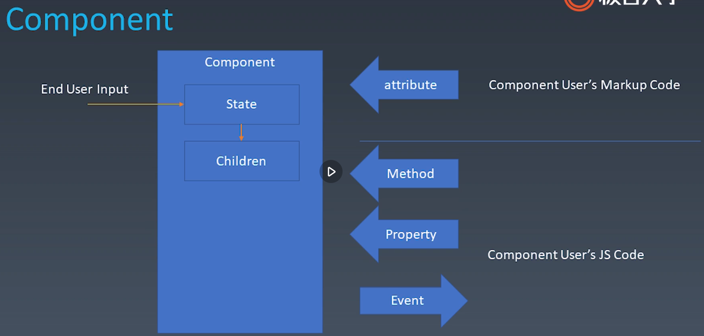
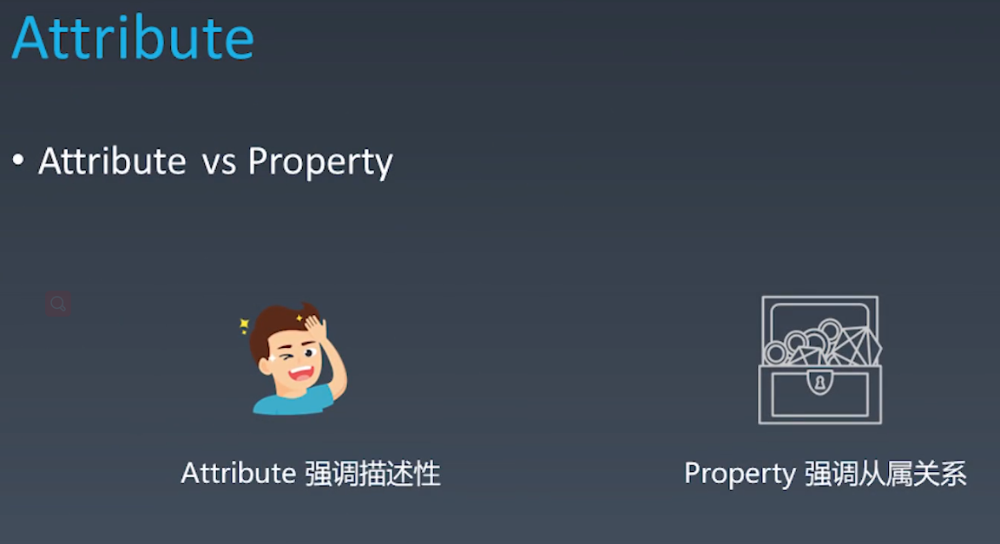
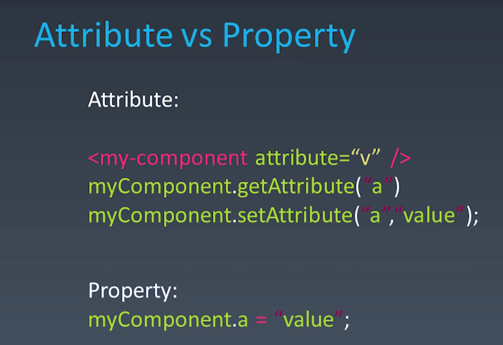
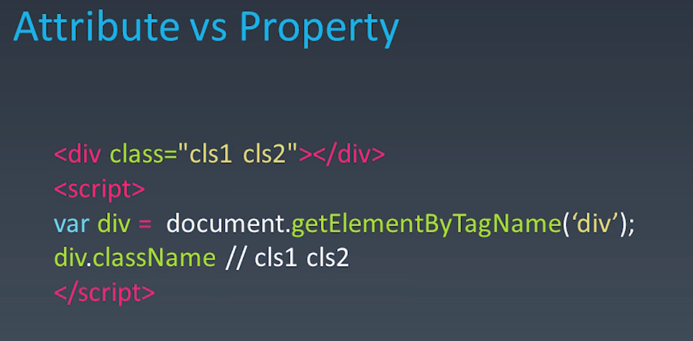
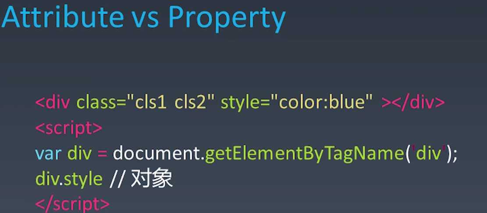
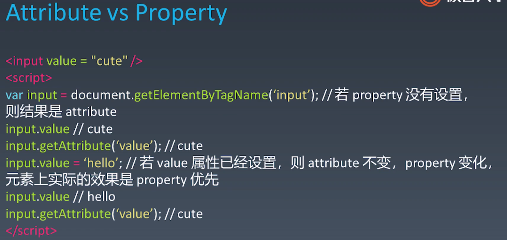
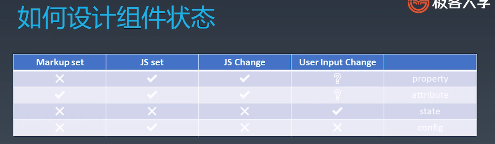
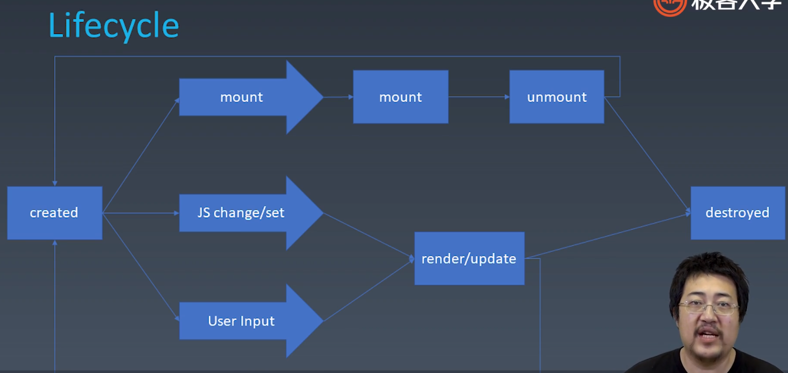
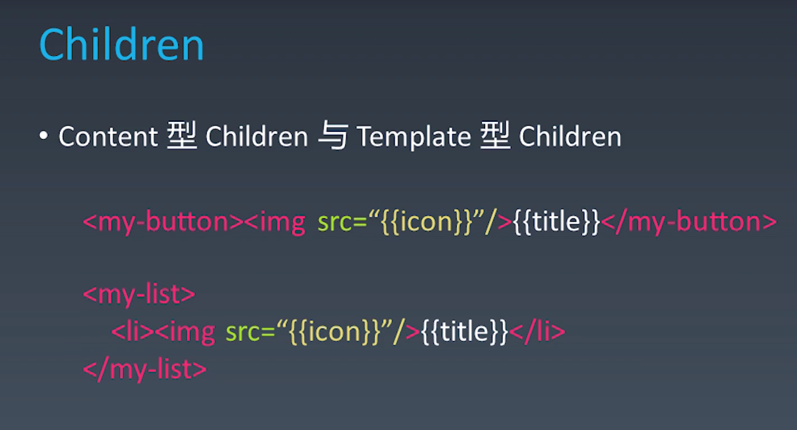

### 对象与组件
| 对象       | 组件               |
| ---------- | ------------------ |
| Properties | Properites（属性） |
| Methods    | Methods            |
| Inherit    | Inherit            |
|            | Attribute(特性)    |
|            | config & State     |
|            | Event              |
|            | Lifecycle          |
|            | Children           |





















### carousel

* 1-n之间循环对n取余就可以了

  ```javascript
  current = current % children.length;
  ```

  

